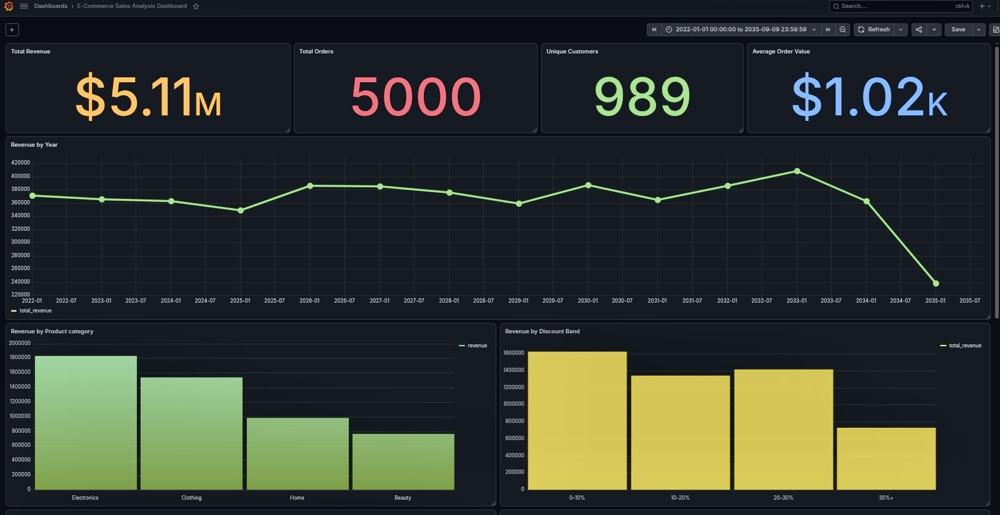

# E-Commerce Sales Analytics Dashboard

An end-to-end data analytics project exploring e-commerce sales performance, customer behavior, and operational metrics using PostgreSQL and Grafana.

## Dashboard Preview


 
## Project Overview

This project analyzes 5,000 e-commerce orders to evaluate sales performance, customer purchasing behavior, product and regional performance, discount patterns, delivery performance, and customer satisfaction.

The analysis uses PostgreSQL to transform and analyze the order-level data through SQL, while Grafana is used to present key findings through an interactive dashboard.

The project also examines repeat-purchase behavior, including customer segmentation, revenue contribution from repeat customers, and the time customers take to place their second order. 

## Tools & Technologies

* **PostgreSQL** — data storage, transformation, and SQL-based analysis
* **SQL** — data aggregation, segmentation, ranking, correlation analysis, and business analysis
* **Grafana** — interactive dashboard and data visualization
* **CSV** — source data format

## Dataset

The dataset contains **5,000 e-commerce orders** with information covering sales, customers, products, discounts, delivery, payments, and customer satisfaction.

Key fields include:

* Order date and order ID
* Customer ID
* Product category
* Region
* Quantity and unit price
* Discount
* Payment method
* Delivery time
* Customer rating
* Revenue

The dataset covers the period from 2022-01-01 to 2035-09-09. The year 2035 is a partial year, with data available through September 9.

## Business Questions

This project explores the following business questions:

* How does revenue and order volume change across years?
* Which product categories generate the most revenue and units sold?
* Which regions contribute the most to overall revenue?
* Which region–category combinations perform best?
* How do average order values differ across categories and regions?
* How do discount levels vary across product categories?
* How do orders and average quantities differ across discount bands?
* How are customers distributed by purchase frequency?
* How much revenue comes from one-time versus repeat customers?
* How quickly do repeat customers make their second purchase?
* How do delivery times vary across product categories and regions?
* What is the distribution of customer ratings?
* Is there a relationship between delivery time and customer rating?

## SQL Analysis

The data was analyzed in PostgreSQL using SQL to investigate sales performance, customer behavior, product and regional performance, discount patterns, delivery performance, and customer satisfaction.

Key analyses include:

* Overall business performance and key sales metrics
* Yearly revenue, order volume, and year-over-year growth
* Product category and regional performance
* Region–category performance comparisons
* Customer purchase-frequency segmentation
* One-time vs. repeat customer revenue analysis
* Time to second purchase for repeat customers
* Discount-band and category-level discount analysis
* Delivery performance by category and region
* Customer rating distribution and summary statistics
* Delivery time and customer rating analysis
* Correlation analysis between delivery time and customer rating

SQL techniques used include:

* Aggregate functions
* `GROUP BY`
* `CASE` expressions
* Common Table Expressions (`WITH`)
* Subqueries
* `JOIN`
* Window functions
* `ROW_NUMBER()`
* `RANK()`
* `LAG()`
* `LEAD()`
* `FILTER`
* `CORR()`

## Dashboard

An interactive Grafana dashboard was created to visualize the key findings from the SQL analysis.

The dashboard focuses on:

* Overall sales performance
* Revenue and order trends
* Product category performance
* Regional performance
* Customer behavior and repeat purchasing
* Discount patterns
* Delivery performance
* Customer satisfaction

Dashboard screenshots are available in the [`dashboard/Screenshots`](./dashboard/Screenshots) directory.

## Key Findings

* **Repeat customers drive the business:** 96.1% of customers made multiple purchases and generated **99.28% of total revenue**.
* **Repeat purchasing is high, but second purchases are often far apart:** 44.84% of repeat customers took more than **730 days** to place their second order, while only 17.79% did so within the first 180 days.
* **Electronics is the strongest product category:** Electronics generated **$1.83M in revenue**, accounting for approximately **35.8% of total revenue**. Its lead is primarily driven by higher order and unit volume rather than the highest average order value.
* **The West is the strongest-performing region:** It leads the other regions in revenue, orders, units sold, and average order value, although the differences between regions are relatively modest.
* **Higher discounts did not correspond to materially larger order quantities:** Average quantity per order remained between **3.98 and 4.11 units** across discount bands.
* **Delivery time showed virtually no linear relationship with customer ratings:** The Pearson correlation between delivery days and customer rating was **−0.018**, indicating essentially no linear relationship in this dataset.

## Project Structure

```text
ecommerce_sales/
├── dashboard/
│   └── Screenshots/
│       ├── dashboard_top.jpeg
│       └── dashboard_bottom.jpeg
├── data/
├── insights/
├── sql/
└── README.md
```

### Directory Description

* **`dashboard/`** — Dashboard-related resources and screenshots
* **`dashboard/Screenshots/`** — Screenshots of the completed Grafana dashboard
* **`data/`** — Source dataset used for the analysis
* **`insights/`** — Additional analysis notes and business insights
* **`sql/`** — SQL queries used for data analysis
* **`README.md`** — Project documentation and summary of the analysis

## How to Reproduce

### 1. Set Up PostgreSQL

Create a PostgreSQL database and create the `ecommerce_sales` table using the schema defined in the project.

Import the dataset from the `data/` directory into the table.

### 2. Run the SQL Analysis

The SQL queries used for the analysis are available in the `sql/` directory.

Run the queries against the `ecommerce_sales` table to reproduce the analysis and generate the metrics used in the dashboard.

### 3. Set Up Grafana

Connect Grafana to the PostgreSQL database using the PostgreSQL data source.

The dashboard queries use the `ecommerce_sales` table to retrieve and visualize the analyzed data.

### 4. Explore the Dashboard

Open the Grafana dashboard to explore the project's key metrics, trends, customer behavior, product performance, regional performance, discounts, delivery, and customer satisfaction.

## Limitations

* The dataset contains **5,000 orders** and represents a single dataset, so the findings should not be treated as industry-wide benchmarks.
* The data covers **2022-01-01 to 2035-09-09**, meaning **2035 is a partial year** and should not be directly compared with the complete years before it.
* The analysis identifies patterns and associations in the data but does not establish causal relationships.
* Customer satisfaction and delivery metrics are analyzed descriptively and through correlation; additional customer-level or operational data would be required to determine the underlying causes of customer ratings.
* Discount analysis focuses on observed relationships between discount levels and order behavior rather than estimating the causal impact of discounts on purchasing decisions.
